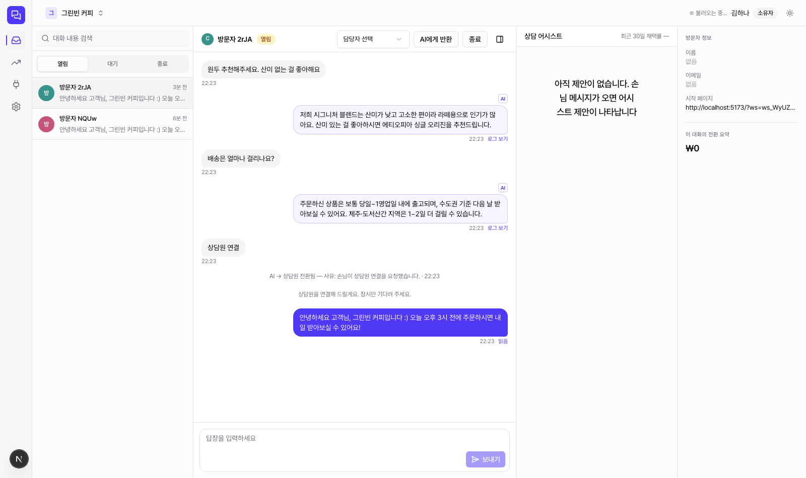
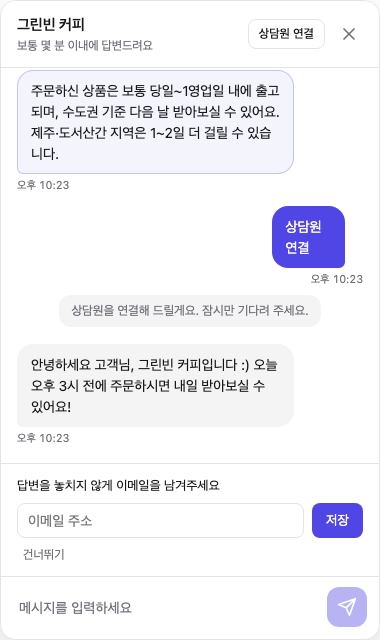

# AideTalk

**한국 SMB를 위한 오픈소스 CS 메신저 — 내가 만든 AI Agent를 5분 만에 내 사이트 채팅에 연결.**

[](./LICENSE)
[](./ee/LICENSE)

**상담 인박스** — 방문자·AI·상담원을 한 문법으로. AI 자동응답은 아웃라인 버블 + "AI" 칩, 핸드오프 후 상담원 답장은 솔리드 버블로 구분됩니다.

<picture>
  <source media="(prefers-color-scheme: dark)" srcset="docs/assets/inbox-dark.png">
  
</picture>

**임베드 위젯** — Shadow DOM 격리, 38KB gzip. 손님에게도 AI 응답임을 투명하게 표시합니다.



## 왜 만들었나

채널톡 같은 국내 CS 메신저는 훌륭하지만 전부 폐쇄형 SaaS다. 반면 요즘 팀들은 이미 자기 손으로
LLM Agent를 만들어봤거나 만들 수 있다 — 그런데 그 Agent를 실제 고객 채팅에 연결하려면
매번 위젯, 인박스, 핸드오프, 권한 격리 같은 인프라를 처음부터 다시 만들어야 한다.

AideTalk는 그 인프라만 오픈소스로 제공한다. **LLM 호출은 여러분이 만든 외부 Agent 서버가
직접 처리**하고(BYO Key — 우리는 OpenAI/Claude 키를 절대 보관하지 않는다), AideTalk는
HTTP 커넥터로 그 Agent를 위젯·인박스와 연결하는 릴레이 역할만 한다. 셀프호스팅은 무료이며,
운영이 귀찮아지면 클라우드로 전환할 수 있다(Open Core — 자세히는 [라이선스](#라이선스) 참고).

## 핵심 기능

- **채팅 위젯** — Preact 기반, 50KB 이하 gzip, Shadow DOM 격리. 카페24/아임웹 등 국내 커머스
  플랫폼 임베드를 상정해 만들었다.
- **AI Agent BYO 커넥터** — HTTP + HMAC 서명 계약(Agent Protocol)만 지키면 어떤 언어/런타임의
  Agent 서버든 연결 가능. Claude API 예제가 Node/Python 둘 다 준비되어 있다.
- **핸드오프 & 상담 인박스** — AI가 답하다가 막히면(또는 손님이 요청하면) 실시간으로 사람
  상담원에게 넘어간다. 대화 목록/검색/실시간 알림을 갖춘 인박스 대시보드 포함.
- **실시간 상담 어시스트** — 상담원이 응대 중일 때 AI가 답변 초안을 제안한다. 제안은 상담원에게만
  보이며 손님에게는 절대 노출되지 않는다.
- **상담 기여 매출(추정) 트래킹** — 링크 클릭/전환을 추적해 "이 상담이 매출로 이어졌는지"를
  추정치로 보여준다(사이트가 있는 워크스페이스 전용). 인과관계를 확정하는 것이 아니라 기여를
  추정하는 도구임을 항상 명시한다.
- **셀프호스팅 = 클라우드와 동일 이미지** — Docker Compose 한 번으로 PostgreSQL + Redis +
  서버 + 대시보드가 뜬다. 환경변수(`EDITION`) 하나만 다르다.

## 30분 셀프호스팅 Quickstart

요구사항: Docker + Docker Compose v2.

```bash
git clone https://github.com/aidetalk/aidetalk.git && cd aidetalk/docker
cp .env.example .env
# .env를 열어 시크릿을 채운다 — 생성: openssl rand -hex 32

docker compose up -d
curl http://localhost:4000/healthz   # {"ok":true} 확인
```

브라우저에서 `http://localhost:3000` 접속 → 가입 → 워크스페이스 생성 → 위젯 설정 화면에서
임베드 코드를 복사해 여러분의 사이트에 붙여넣으면 첫 대화를 받을 준비가 끝난다.

더 자세한 절차(환경변수 표, 리버스 프록시, 백업)는 [설치 가이드](#문서)를 참고.

## 내 AI Agent 연결하기

이미 Agent가 있다면 [Agent Protocol](#문서) 계약(HTTP + HMAC 서명)만 구현하면 된다. 아직
없다면 저장소에 바로 실행 가능한 예제가 두 언어로 준비되어 있다 — 둘 다 Claude API로 FAQ에
답하고, 처리 못 하는 요청은 사람에게 핸드오프한다.

```bash
cd examples/agent-node        # 또는 examples/agent-python
# README 첫 줄이 이렇게 되어 있다:
# "이 레포를 Claude Code에 열고 '우리 쇼핑몰 정책에 맞게 고쳐줘'라고 하세요."
```

연결 방법: 대시보드 > Agent 커넥터에서 새 Agent 등록 → Endpoint URL 입력 → 발급된 secret을
예제의 `.env`에 붙여넣기 → "연결 테스트"로 확인. 자세한 절차는 [예제 에이전트 가이드](#문서) 참고.

## 문서

- 설치 가이드, Agent Protocol(외부 공개 계약), 위젯 임베드/CSP 가이드, 예제 에이전트 안내는
  문서 사이트에서 볼 수 있다: **https://docs.aidetalk.io** (TODO(action): 도메인 확정/배포 후 연결 — 그 전까지는 `apps/docs/`를 로컬에서 `pnpm --filter @aidetalk/docs dev`로 직접 볼 수 있다)
- 아키텍처/데이터 모델/API 명세 등 구현 상세 문서는 이 저장소의 `docs/` 아래에 공개되어 있다
  (`docs/02_ARCHITECTURE.md` ~ `docs/12_GIT_STRATEGY.md`).

## 라이선스

**Open Core.** 코어(위젯 + 인박스 + Agent 커넥터 + 셀프호스팅에 필요한 모든 것)는
**[AGPL-3.0](./LICENSE)**으로 무료 오픈소스다. 셀프호스팅에 기능 제한은 없다.

클라우드 전용 코드(결제, 플랜 한도, 자동 백업 등)는 `ee/` 디렉토리 아래 별도
**[상용 라이선스](./ee/LICENSE)**를 따른다. `ee/` 없이도 코어는 완전히 빌드·구동된다 —
`ee/`는 우리가 운영하는 클라우드 서비스를 위한 선택적 확장일 뿐이다.

## 기여하기

버그 제보, 기능 제안, 코드 기여 모두 환영한다. 시작하기 전에 **[CONTRIBUTING.md](./CONTRIBUTING.md)**를
읽어보길 권한다 — 개발 환경 셋업, 브랜치/PR 규칙, 테스트 필수 영역, DCO(Developer Certificate
of Origin) 서명 방법이 정리되어 있다. 행동 강령은 **[CODE_OF_CONDUCT.md](./CODE_OF_CONDUCT.md)**,
보안 취약점 제보는 **[SECURITY.md](./SECURITY.md)**를 참고.
